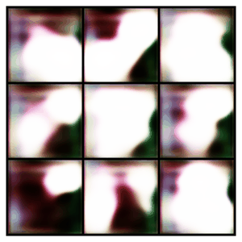
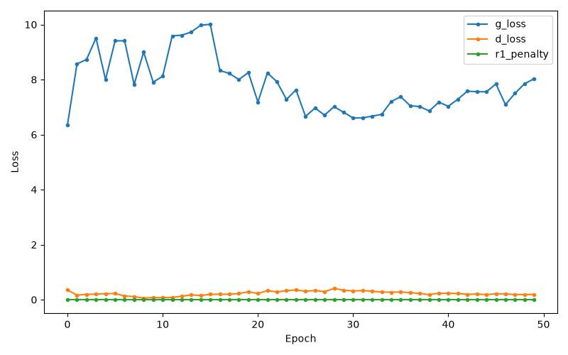

## MEOWDEL

A GAN built from scratch in PyTorch + PyTorch Lightning, trained to generate cat face images (64x64 RGB) from the [Kaggle "Cats faces 64x64" dataset](https://www.kaggle.com/datasets/spandan2/cats-faces-64x64-for-generative-models).

### Layout

```
config.yaml     - all hyperparameters and flags, single source of truth
data.py         - downloads/loads the Kaggle cat faces dataset
model.py        - Generator and Discriminator (DCGAN-style, 64x64 RGB)
gan_module.py   - LitGAN: the Lightning training loop (manual optimization)
train.py        - entrypoint: python train.py [--config path/to/config.yaml]
util.py         - seeding, run-folder + plotting helpers
make_progress_gif.py - stitches a run's per-epoch samples into assets/training_progress.gif
```

### Setup

Clone the repo and install dependencies. The steps are the same on macOS and Windows except for how you activate the virtual environment:

```
git clone https://github.com/Adi-UA/MEOWDEL.git
cd MEOWDEL
python3 -m venv .venv
```

macOS/Linux:
```
source .venv/bin/activate
```

Windows (PowerShell):
```
.venv\Scripts\Activate.ps1
```

Then, on either machine:
```
pip install -r requirements.txt
```

`pip install torch` alone pulls the CPU-only build on Windows. `requirements.txt` will satisfy itself with that CPU wheel silently, no error, so check for CUDA after installing:

```
python -c "import torch; print(torch.cuda.is_available())"
```

If that prints `False` on a machine with an NVIDIA GPU, force-reinstall from the CUDA-specific index (match the `cuXXX` tag to your driver's supported CUDA version, shown by `nvidia-smi`):

```
pip install --force-reinstall torch torchvision --index-url https://download.pytorch.org/whl/cu132
```

`--force-reinstall` is required: pip sees a `torch` package already satisfying the version constraint and skips it otherwise, even though it's the wrong build.

You'll need Kaggle API credentials so `kagglehub` can download the dataset. Either:
- place a `kaggle.json` (with `username` and `key`) at `~/.kaggle/kaggle.json` (`C:\Users\<you>\.kaggle\kaggle.json` on Windows), or
- set the `KAGGLE_USERNAME` and `KAGGLE_KEY` environment variables.

This is a one-time setup needed on each machine you train on.

### Training

```
python train.py
```

No code changes are needed between machines: `train.py` uses `accelerator="auto"`, so PyTorch Lightning detects the best available hardware at runtime — CUDA on the Windows/4060ti box, Apple's MPS on a Mac, or CPU as a fallback. Same command, same config, whichever machine you're on.

To run a different configuration without editing `config.yaml`, copy it and pass `--config`:

```
python train.py --config config.my_experiment.yaml
```

Each run creates a timestamped folder under `outputs/`:

```
outputs/<timestamp>/
  checkpoints/last.ckpt   - Lightning checkpoint (resumable)
  samples/epoch_XXX.png   - a 3x3 grid from a fixed noise vector, saved every epoch
  loss_curve.png          - generator/discriminator/R1 loss curve, saved at the end
  metrics.csv             - raw per-epoch metrics
  events.out.tfevents.*   - TensorBoard logs (`tensorboard --logdir outputs`)
```

Final generator/discriminator weights are also saved to `save_path` from the config (e.g. `models/baseline/generator.pth`), one subfolder per experiment so re-running a different config doesn't overwrite an earlier one's weights.

### Research flags (`config.yaml`)

Two optional techniques from GAN research papers, both off by default. Short technical description first, plain-language version underneath so you can relearn what they actually do without re-reading the papers.

**`spectral_norm`** (bool) — [Miyato et al. 2018](https://arxiv.org/abs/1802.05957). Wraps every discriminator conv layer in spectral normalization, which constrains how much the layer's output can change relative to its input (its "Lipschitz constant"). BatchNorm is skipped on the discriminator when this is on, since the two are known to fight each other.

> In plain terms: without this, the discriminator can become so confident, so fast, that it stops giving the generator anything useful to learn from (its gradient goes flat). Spectral norm puts a speed limit on how sharply the discriminator is allowed to react to small changes in its input, which keeps it from steamrolling the generator early in training.

**`r1_gamma`** (float, `0` disables) + **`r1_interval`** — [Mescheder et al. 2018](https://arxiv.org/abs/1801.04406). Adds a penalty term equal to the squared gradient norm of the discriminator's output with respect to real images, scaled by `r1_gamma`. Applied lazily, only every `r1_interval` steps (the StyleGAN2 approach), to cut the cost of the extra backward pass it requires. A typical value is `r1_gamma: 10`.

> In plain terms: imagine the discriminator's judgment as a landscape, and real images sit at the bottom of valleys in that landscape. If the valley walls are too steep right around real images, the generator gets yanked around wildly once it starts producing samples close to real ones — training oscillates instead of settling down. This penalty forces the discriminator to keep the ground flat around real images, which is what actually lets training converge instead of chasing its own tail forever.

Both flags were smoke-tested (1 epoch each) alongside the baseline configuration before this README was written.

### Learnings

A few classic GAN training pitfalls came up while building this, worth remembering for next time:

- **Match the generator's output range to how you normalize the data.** If real images are normalized to `[-1, 1]`, the generator's last layer needs a `Tanh` to match. Otherwise the discriminator can win by checking whether pixel values fall in the expected range, without ever learning real structure.
- **Never inject noise directly into a hard 0/1 label.** It can push the label outside `[0, 1]`, which corrupts `BCEWithLogitsLoss` (a giveaway is the loss going negative, which is mathematically impossible for a valid target). If you want to fight discriminator overconfidence, use a fixed offset (e.g. real target `0.9`) or a principled method like the R1 gradient penalty below, not random noise on the target.
- **BatchNorm isn't optional in a from-scratch GAN.** Without it, small differences in how fast the generator and discriminator learn can compound across layers and epochs until one saturates the other and training collapses.
- **Downsample with strided convolutions, not pooling.** Pooling throws away spatial gradient information the discriminator needs.
- **`.detach()` matters.** Feeding the generator's output into the discriminator's own training step without detaching it wastes memory and compute building gradients into the generator that get discarded immediately after.

### Results

50 epochs on the 4060ti box, ~33 minutes, baseline config (`spectral_norm` and `r1_gamma` both off). Same fixed noise vector sampled after every epoch:



Final epoch losses: `g_loss` 8.03, `d_loss` 0.187 (started at 6.36 / 0.355 respectively). The discriminator loss trending down while generator loss trends up across the run is the classic sign of the discriminator winning; worth revisiting with `r1_gamma` or `spectral_norm` turned on for a steadier balance.



Regenerate the GIF from any run's saved samples with:

```
python make_progress_gif.py outputs/<timestamp>
```

**Next experiment**: `config.spectral_r1.yaml` turns on both `spectral_norm` and `r1_gamma: 10.0` together (neither was run past a 1-epoch smoke test before), aimed at the discriminator-winning pattern above. Weights save to `models/spectral_r1/` so they don't collide with the baseline.

```
python train.py --config config.spectral_r1.yaml
```
